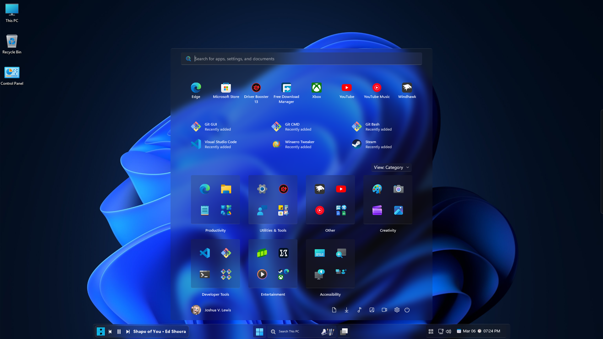
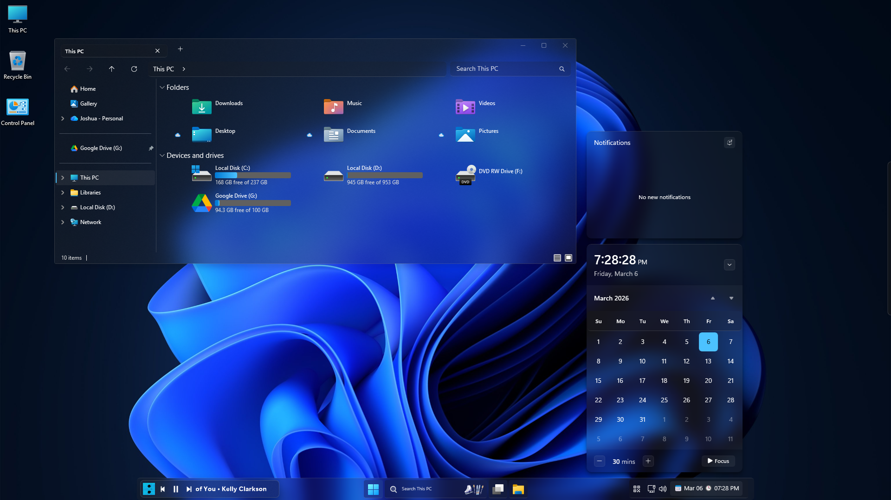

# Liquid Glass Theme

 

#### If you'd like to help, feel free to open a PR with your improvements and/or fixes! You can see a list of currently planned changes in our [TO-DO](https://github.com/The-Back-Room/Liquid-Glass-Theme/wiki/To%E2%80%90Do) page.

## Instructions
Follow the instructions below to setup the Liquid Glass themes on your system.

* [Start Menu](/Start%20Menu/README.md) - Instructions for setting up the Windows Glass Start Menu theme.
* [Taskbar](/Taskbar/README.md) - Instructions for setting up the Windows Glass Taskbar theme.
* [Notification Center](/Notification%20Center/README.md) - Instructions for setting up the Windows Glass Notification Center theme.
* [File Explorer](/File%20Explorer/README.md) - Instructions for setting up the Windows Glass File Explorer theme.

Check the [Excluding Unwanted Processes](https://github.com/The-Back-Room/Liquid-Glass-Theme/wiki/Excluding-Unwanted-Processes) page on the [wiki](https://github.com/The-Back-Room/Liquid-Glass-Theme/wiki) to learn how to exclude MS Office apps and other unwanted and/or incompatible processes.

---

#### If you have any issues or need help, check the [wiki](https://github.com/The-Back-Room/Liquid-Glass-Theme/wiki). If your issue isn't listed there, feel free to [open an issue](https://github.com/The-Back-Room/Liquid-Glass-Theme/issues).

